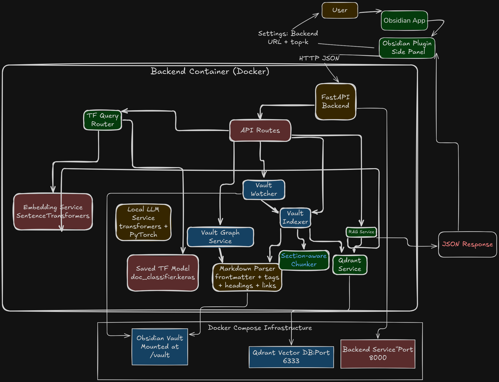

# ObsidianAI - Local Document Intelligence

Local AI-powered document intelligence for Obsidian using FastAPI, SentenceTransformers, local `transformers` LLM, TensorFlow query routing, and Qdrant.

## Architecture

- `backend/`: FastAPI app (RAG, indexing, semantic search, graph endpoint, watcher)
- `plugin/obsidian-doc-intel/`: Obsidian plugin (side panel chat + source preview)
- `docker-compose.yml`: Qdrant + backend services

## Features

- Index all Markdown files from your vault
- Parse frontmatter, tags, headings, wikilinks
- Section-aware chunking with overlap
- Embedding generation via SentenceTransformers
- Qdrant vector storage with rich metadata
- REST endpoints:
  - `POST /index`
  - `POST /query`
  - `POST /summarize`
  - `POST /classify`
  - `POST /semantic-search`
  - `GET /graph`
  - `GET /health`
- RAG pipeline with prompt routing via TensorFlow classifier
- File watcher auto re-index on markdown changes
- Obsidian plugin chat UI, source links, history, loading/error UX

## Prerequisites

- Docker + Docker Compose
- Obsidian desktop app
- Node.js 18+ (for plugin build)

## Setup

1. Copy env template:

```bash
cp .env.example .env
```

2. Edit `.env` and set your vault path:

```env
OBSIDIAN_VAULT_PATH=/absolute/path/to/your/vault
```

3. Start stack:

```bash
docker compose up --build
```

4. Verify health:

```bash
curl http://127.0.0.1:8000/health
```

## Docker Commands

- Start: `docker compose up --build`
- Detached: `docker compose up -d --build`
- Stop: `docker compose down`
- Reset vectors: `docker compose down -v`
- Logs: `docker compose logs -f backend`

## Backend Scripts

From `backend/`:

```bash
./scripts/bootstrap_dev.sh   # install runtime + dev deps
./scripts/run_api.sh         # run local FastAPI with reload
./scripts/run_tests.sh       # run pytest (or fallback compile check)
./scripts/lint.sh            # ruff checks
./scripts/format.sh          # black format
./scripts/smoke_api.sh       # basic API smoke calls against running backend
```

## API Examples

Index:

```bash
curl -X POST http://127.0.0.1:8000/index -H 'Content-Type: application/json' -d '{"force_full": true}'
```

Query:

```bash
curl -X POST http://127.0.0.1:8000/query -H 'Content-Type: application/json' -d '{"query":"What are my Q1 priorities?","top_k":6}'
```

Summarize:

```bash
curl -X POST http://127.0.0.1:8000/summarize -H 'Content-Type: application/json' -d '{"text":"# Notes ..."}'
```

Classify:

```bash
curl -X POST http://127.0.0.1:8000/classify -H 'Content-Type: application/json' -d '{"text":"Summarize this sprint note"}'
```

Graph notes:

```bash
curl http://127.0.0.1:8000/graph
```

## TensorFlow Classifier Model

Backend loads classifier from `/app/models/doc_classifier.keras`.

To generate a placeholder model locally:

```bash
python3 backend/scripts/train_classifier.py --output backend/models/doc_classifier.keras
```

Then restart backend:

```bash
docker compose restart backend
```

## Obsidian Plugin Install

1. Build plugin:

```bash
cd plugin/obsidian-doc-intel
npm install
npm run build
```

2. Copy plugin folder to your vault plugins path:

```bash
<Vault>/.obsidian/plugins/obsidian-doc-intel
```

Required files in that folder:

- `main.js`
- `manifest.json`
- `styles.css`

3. In Obsidian:

- Settings -> Community plugins -> Reload plugins
- Enable `Obsidian Doc Intelligence`
- Open plugin settings and set backend URL (default `http://127.0.0.1:8000`)
- Open side panel via ribbon icon or command palette

## Example Queries

- "Summarize my project planning notes from this vault"
- "What tasks with deadlines are mentioned in my notes?"
- "Compare the architecture decisions in ADR files"
- "Which notes mention Qdrant and embeddings?"

## Security Notes

- Backend middleware only allows loopback/private network clients
- CORS is restricted via `CORS_ORIGINS` env var
- Keep this service local and avoid public exposure

## Troubleshooting

- `health` fails / Qdrant unavailable:
  - Run `docker compose logs -f qdrant backend`
  - Ensure port `6333` is free
- No files indexed:
  - Verify `OBSIDIAN_VAULT_PATH` in `.env`
  - Ensure vault contains `.md` files
- Slow first startup:
  - Model downloads (embedding + LLM) happen on first run
- Plugin can’t connect:
  - Confirm backend at `http://127.0.0.1:8000/health`
  - Check plugin `Backend URL` setting
- Classifier warning at startup:
  - Train or place model at `backend/models/doc_classifier.keras`
  - Fallback heuristic routing is used until model exists
